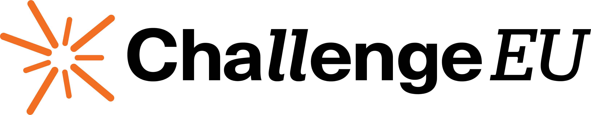

# Logo – A Visual Expression of the Brand

The **ChallengeEU logo** captures **collaboration, progress, and purpose**.

---

## Symbol
- **9 rays** = 9 partner universities  
- **Outward motion** = shared direction & innovation  
- **Unity through action**, not uniformity

## Wordmark
- **"challenge"** – forward-leaning `ll` = motion & ambition  
- **"EU"** – stable, formal = institutional strength  
- **Contrast** = youthful energy + structural integrity

---

## Logo Variants

| Variant | Use Case |
|--------|---------|
| **Horizontal Lockup** | Default (symbol + wordmark) |
| **Horizontal Expanded** | + "European University Alliance" |
| **Vertical Micro** | Small spaces (stacked) |
| **Vertical Macro** | Large banners (centered) |
| **Symbol Only** | Icons, avatars, merch |
| **Typography Only** | Formal docs, subtle use |

---

## Minimum Size
- **Digital**: 40 px height  
- **Print**: 3 mm height

---

## Backgrounds

### Solid Colors
- Use **white logo** on dark/orange  
- Use **black logo** on light  
- Never use unapproved colors

### Photos
- **White logo** on dark images  
- **Full-color/black** on light  
- Add **subtle overlay** if needed  
- Avoid noisy backgrounds

---

## Incorrect Usage

| Don't |
|-------|
| Change colors |
| Outline or stroke |
| Use low-res |
| Crop or distort |
| Rotate (unless pattern) |
| Insert into text |
| Mirror/flip |
| Use Key Visual signets as logo |

---
